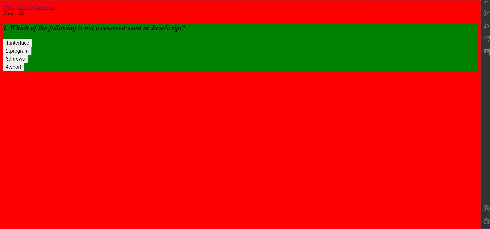

This is a coding quiz consisting of 5 javascript questions. When the user selects their answer,

an 'incorrect' or a 'correct' remark is displayed on the screen. The quiz score is diplayed once the

user completes all the 5 questions.

The URL of the functional, deployed application - https://rohanrulz.github.io/Code-Quiz/

